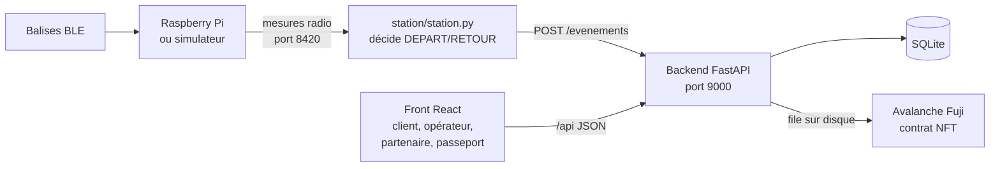
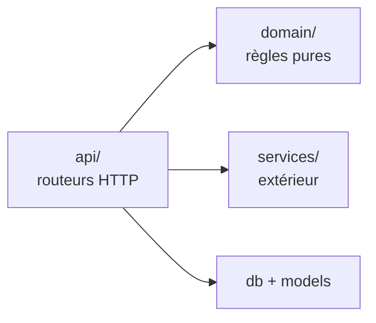
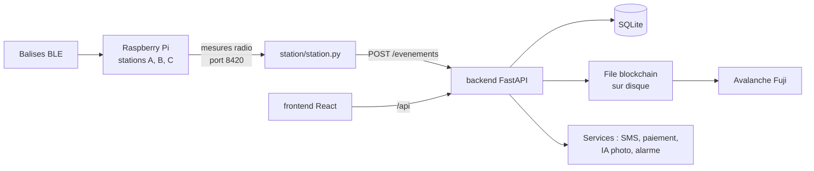
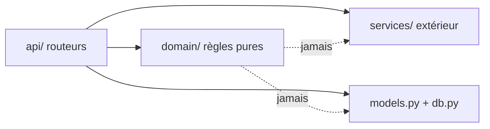

# Grab&Surf : architecture technique

Sep 25, 2026 · Complément technique du brief projet, à valider par Dev1 et Dev2

## En bref

- **Front** : une seule application React (Vite), 4 interfaces, pensée mobile d'abord.
- **Backend** : Python avec FastAPI, API JSON documentée automatiquement.
- **Données** : SQLAlchemy 2 avec SQLite pour le hackathon ; PostgreSQL en production en changeant une ligne.
- **Blockchain** : Avalanche Fuji, contrat ERC-721 déjà déployé et vérifié, écriture en arrière-plan.
- **Station** : Python bibliothèque standard, protocole du kit conservé.
- **Code en anglais** (fichiers, variables, fonctions), textes affichés en français et en anglais, documentation en français.

Ce document complète le brief projet : le brief dit quoi et pourquoi, celui-ci dit comment.

## Choix techniques et raisons

| Sujet | Choix | Raison en une phrase | Écarté |
| --- | --- | --- | --- |
| Front | React + Vite | L'équipe le maîtrise, Claude le génère très bien, interface riche en peu de temps | Pages HTML sans framework : trop pauvres pour 4 interfaces |
| Serveur du front | Aucun : Vite en développement, build servi par Python en démo | Un seul backend à maintenir | Backend Node : deux backends pour rien |
| Backend | Python + FastAPI | Kit, station et `web3` déjà en Python ; routeurs par domaine ; doc d'API automatique sur `/docs` ; client de test pour l'e2e | Serveur de la bibliothèque standard : routage manuel, conflits à deux |
| ORM | SQLAlchemy 2 | Standard Python, bascule vers PostgreSQL sans réécrire le code | SQL à la main |
| Base | SQLite (un fichier) | Rien à installer, aucun risque de panne en démo | PostgreSQL : environ 45 min d'installation et de configuration sur chaque Mac |
| Migrations | Aucune pendant le hackathon : tables créées au démarrage, `seed.py` recrée les données de démo | Le schéma change vite, on recrée la base en une commande | Alembic : utile en production, coûteux maintenant |
| Montants | Entiers en centimes | Aucune erreur d'arrondi | Nombres à virgule |
| Blockchain | Avalanche Fuji, ERC-721 OpenZeppelin, `web3.py` | Déjà déployé, vérifié et testé | Wallet utilisateur, paiement en crypto |
| Tests | `pytest` + client de test FastAPI | Tests courts, e2e sans lancer de vrai serveur | Tests manuels seulement |
| CI | GitHub Actions sur chaque PR | 15 lignes, empêche de merger un code cassé | Pas de CI |
| Langue du code | Anglais | Lisible par tout développeur et toute IA | Français mélangé à l'anglais |

**Exception à l'anglais** : le protocole du kit des organisateurs reste tel quel (`"evenement": "DEPART"`, `"balise"`, `POST /evenements`), car les stations et le simulateur l'utilisent déjà.

## Vue d'ensemble



La station décide seule et pousse ses événements au backend. Le backend est la seule source de vérité applicative ; il écrit sur la chaîne en arrière-plan, sans jamais faire attendre une location. Le front ne parle qu'au backend, jamais à la blockchain directement.

**Ports** : simulateur 8080 (contrôle) et 8420 (flux), backend 9000, Vite 5173 en développement (redirige `/api` et `/evenements` vers 9000).

## Arborescence du dépôt

Un dossier par responsabilité, un propriétaire par dossier : Dev1 et Dev2 travaillent en parallèle avec très peu de fichiers en commun.

```
grabandsurf/
├── CLAUDE.md                 règles de travail pour les humains et Claude Code
├── README.md                 installation
├── config.json               tarifs, plafond, caution, cagnotte, parrainage (aucun secret)
├── env.example               modèle du .env (le .env n'est jamais committé)
├── docs/
│   ├── BRIEF.md              brief projet (quoi, pourquoi)
│   ├── ARCHITECTURE.md       ce document (comment)
│   ├── BLOCKCHAIN.md         détail blockchain
│   └── MOCKUPS.md            brief des maquettes (parcours et écrans)
├── korko-kit/                kit des organisateurs : LECTURE SEULE
├── backend/
│   ├── requirements.txt
│   ├── app/
│   │   ├── main.py           crée l'app FastAPI, branche les routeurs, sert le build du front
│   │   ├── settings.py       lit config.json et .env
│   │   ├── db.py             connexion SQLAlchemy, création des tables
│   │   ├── models.py         tables (partagé, figé après le cadrage)
│   │   ├── schemas.py        formats JSON des requêtes et réponses (partagé)
│   │   ├── domain/           logique métier pure
│   │   │   ├── pricing.py    prix, forfait journée, achat implicite
│   │   │   ├── fleet.py      traitement des événements, statuts, sessions
│   │   │   ├── wallet.py     cagnotte : photo, parrainage
│   │   │   ├── packs.py      packs d'heures partenaires
│   │   │   └── missions.py   les 3 missions de l'opérateur
│   │   ├── services/         tout ce qui touche l'extérieur, avec une version factice
│   │   │   ├── sms.py        boîte SMS de démo
│   │   │   ├── payment.py    empreinte bancaire fictive
│   │   │   ├── photo_ai.py   analyse photo par Claude, réponse simulée sans clé
│   │   │   ├── alarm.py      son de l'ordinateur, buzzer du Pi
│   │   │   └── chain.py      écriture on-chain en arrière-plan (ex korko_chain.py)
│   │   └── api/              un routeur FastAPI par domaine
│   ├── chain/                contrat, ABI, deployment.json, scripts wallet et déploiement
│   ├── scripts/seed.py       données de démo
│   └── tests/                unit/ et e2e/
├── station/
│   └── station.py            code station : journal sur disque, reprise, alarme
├── frontend/                 Vite + React
│   └── src/
│       ├── App.jsx           les 4 routes
│       ├── api.js            le seul endroit qui appelle le backend
│       ├── components/       composants partagés
│       └── pages/            customer/  partner/  operator/  passport/
├── scripts/dev.sh            lance simulateur, backend, front et station
└── data/                     base SQLite, photos, files d'attente (ignoré par git)
```

| Dossier ou fichier | Propriétaire |
| --- | --- |
| `frontend/src/pages/customer/`, `frontend/src/pages/partner/` | Dev1 |
| `backend/app/api/customers.py`, `rentals.py`, `partners.py` | Dev1 |
| `backend/app/domain/pricing.py`, `wallet.py`, `packs.py` | Dev1 |
| `backend/app/services/sms.py`, `payment.py` | Dev1 |
| `station/` | Dev1 |
| `frontend/src/pages/operator/`, `frontend/src/pages/passport/` | Dev2 |
| `backend/app/api/stations.py`, `fleet.py`, `photos.py`, `passport.py` | Dev2 |
| `backend/app/domain/fleet.py`, `missions.py` | Dev2 |
| `backend/app/services/photo_ai.py`, `alarm.py`, `chain.py`, `backend/chain/` | Dev2 |
| `models.py`, `schemas.py`, `main.py`, `App.jsx`, `api.js`, `components/`, `config.json` | **Partagés** : écrits ensemble au cadrage, toute modification ensuite est annoncée à l'autre |

## Couches du backend



Trois règles, qui rendent le code testable et limitent les conflits :

1. **`domain/` est pur** : ni base de données, ni réseau, ni fichier, ni horloge système. Il reçoit des données et l'heure `t` en paramètres, et renvoie un résultat. Exemple : `pricing.price_cents(start_t, end_t, config)`.
2. **`services/` isole l'extérieur** : chaque service a une vraie version et une version factice, choisies par `settings.py` (`DEMO_MODE`). SMS, paiement, IA, alarme, blockchain : tout peut tomber en démo sans casser le parcours.
3. **`api/` orchestre** : il lit la base, appelle le domaine, déclenche les services, écrit la base. Les routeurs ne s'appellent pas entre eux ; ce qui est commun va dans `domain/` ou `services/`.

**L'heure** : jamais `time.time()` dans le domaine. L'heure de référence est le dernier `t` reçu des stations (règle du kit), conservée par `fleet.py`.

## Base de données

Tout ce qui n'est pas sur la blockchain vit ici : clients, locations, paiements, cagnotte, photos, partenaires. SQLite pour le hackathon (fichier `data/app.db`), PostgreSQL en production via `DATABASE_URL`.

| Table | Colonnes principales | Remarques |
| --- | --- | --- |
| `customers` | `id`, `phone` (unique), `referral_code` (unique), `referred_by_id`, `card_hold_status`, `created_t` | Le téléphone est le compte |
| `otp_codes` | `phone`, `code`, `expires_t`, `used` | Codes SMS |
| `boards` | `id` (`korko-01`), `home_station`, `current_station`, `status`, `rentals_count`, `beacon_installed_t` | Statuts : `at_rack`, `at_sea`, `away_from_home`, `workshop`, `lost`, `sold`, `silent` |
| `station_events` | `id`, `station`, `board_id`, `type`, `t`, `received_t` | **Contrainte unique** (`station`, `board_id`, `t`, `type`) = anti-doublon |
| `rentals` | `id`, `customer_id`, `board_id`, `start_station`, `end_station`, `start_t`, `end_t`, `status`, `price_cents`, `pack_code`, `return_mode` | Statuts : `armed`, `active`, `returned`, `declared_return`, `lost`, `bought` ; `return_mode` : `detected` ou `qr` |
| `card_holds` | `id`, `customer_id`, `rental_id`, `amount_cents`, `captured_cents`, `status` | `authorized`, `captured`, `released` |
| `wallet_ledger` | `id`, `customer_id`, `amount_cents` (+ ou −), `reason`, `rental_id` | Solde = somme des lignes. Raisons : `photo`, `referral_sponsor`, `referral_guest`, `rental_discount` |
| `photos` | `id`, `rental_id`, `board_id`, `sha256`, `path`, `ai_result` (JSON), `validated` | `validated` : vide, vrai ou faux (décision de l'opérateur) |
| `damage_reports` | `id`, `board_id`, `rental_id`, `zone`, `photo_id`, `status` |  |
| `partners` | `id`, `name` |  |
| `packs` | `id`, `partner_id`, `hours`, `price_cents` |  |
| `pack_codes` | `code`, `pack_id`, `minutes_quota`, `minutes_used` | Format `MAIF-7K2P` |
| `chain_txs` | `id`, `board_id`, `event_type`, `t`, `tx_hash`, `status` | Pour afficher les liens Snowtrace |

**Conventions** :

- Montants en **centimes entiers** (`_cents`), jamais de nombre à virgule.
- Heures en secondes de flux (`_t`), jamais l'horloge système.
- Aucune donnée de `customers` n'est envoyée à la blockchain.
- `backend/scripts/seed.py` vide la base et recrée les 6 planches, une cliente de démo, un partenaire MAIF et ses codes. On le relance avant chaque répétition.

## API

La liste complète et à jour est générée par FastAPI sur `http://localhost:9000/docs` : c'est **le contrat** entre le front et le back. Ce tableau fixe les noms de départ.

| Méthode et chemin | Rôle | Qui |
| --- | --- | --- |
| `POST /api/customers/otp` | Envoie un code SMS `{phone}` | Dev1 |
| `POST /api/customers/verify` | Vérifie le code, crée le client `{phone, code, referral_code?}` | Dev1 |
| `POST /api/customers/{phone}/card-hold` | Empreinte bancaire fictive | Dev1 |
| `GET /api/customers/{phone}` | Cagnotte, code de parrainage | Dev1 |
| `POST /api/rentals` | Arme une location `{phone, station, pack_code?}`, renvoie la planche | Dev1 |
| `GET /api/rentals/current?phone=` | Location en cours : statut, durée, prix courant | Dev1 |
| `POST /api/rentals/{id}/declare-return` | Retour par QR du rack + QR de la planche | Dev1 |
| `GET /api/sms?phone=` | Boîte SMS de démo | Dev1 |
| `POST /api/partners/packs`, `GET /api/partners/{id}/dashboard` | Packs d'heures et tableau partenaire | Dev1 |
| `POST /evenements` | **Protocole du kit, inchangé** : événements des stations ; réponse `{"alarm": ["korko-01"]}` | Dev2 |
| `GET /api/fleet` | Planches, stations en ligne ou non, alertes | Dev2 |
| `GET /api/operator/missions` | Les 3 missions du jour avec leur phrase | Dev2 |
| `POST /api/operator/photos/{id}/decision` | Valider ou refuser un diagnostic IA | Dev2 |
| `POST /api/photos` | Photo de retour (multipart), diagnostic IA, crédit | Dev2 |
| `POST /api/damage-reports` | Signalement de casse | Dev2 |
| `GET /api/passport/{board_id}` | Historique on-chain, ambassadeur | Dev2 |
| `GET /api/chain/status` | Mode perso ou équipe, file d'attente, dernières transactions | Dev2 |

**Protocole des stations** (kit, inchangé) :

- Mesure radio : `{"t": 1725873012.412, "station": "A", "balise": "korko-07", "rssi": -71}`
- Événement : `{"t": …, "station": "A", "balise": "korko-07", "evenement": "DEPART"}`, avec `DEPART`, `RETOUR`, `ETRANGERE`, et `TIC` comme battement.
- Le backend traduit à l'entrée : `balise` → `board_id`, `evenement` → `type`.

# Grab&Surf : architecture technique

Sep 25, 2026 · Document de travail, à valider par l'équipe

Document technique de référence pour les développeurs et les IA qui codent. Le brief projet dit **quoi** et **pourquoi** ; ce document dit **comment**. Les règles de travail détaillées sont dans CLAUDE.md, à la racine du dépôt.

## En bref

Un backend **Python FastAPI** avec une base **SQLite via SQLAlchemy**, un frontend **React (Vite)**, une couche **blockchain Avalanche** en arrière-plan, et le code **station** du kit. Tout le code est en anglais ; les textes affichés sont en français et en anglais.

| Brique | Choix | Raison en une ligne |
| --- | --- | --- |
| Backend | Python 3.12, FastAPI, Uvicorn | Le kit, la station et web3 sont déjà en Python ; routeurs séparés par domaine, doc d'API automatique, client de test pour l'e2e |
| Base de données | SQLite + SQLAlchemy 2 (ORM) | Zéro installation, un fichier ; passage à PostgreSQL en changeant l'URL de connexion |
| Migrations | Aucune pendant le hackathon | Tables créées au démarrage, `seed.py` recrée une démo propre ; Alembic en production |
| Frontend | React 18 + Vite + React Router, JavaScript | Rapide à produire avec Claude, maîtrisé par l'équipe ; une seule app pour les 4 interfaces |
| Styles | Tailwind CSS | Très rapide à écrire et à faire générer, mobile d'abord |
| Serveur Node | Aucun | Vite ne sert qu'au développement et au build ; Python sert le build en démo |
| Temps réel | Rafraîchissement toutes les 2 s | Plus simple et plus robuste que des WebSockets en 6 h |
| Blockchain | Avalanche Fuji, ERC-721, web3.py | Déjà déployé et vérifié ; l'usager ne signe rien |
| IA photo | Modèle Claude avec vision, réponse simulée en secours | Diagnostic de casse ; la démo ne dépend pas du réseau |
| Tests | unittest + client de test FastAPI | Rien à installer côté tests ; l'e2e rejoue le scénario de démo |
| CI | GitHub Actions | Tests lancés à chaque PR, un fichier de 20 lignes |

## Vue d'ensemble



Le code station tourne sur l'ordinateur, pas sur le Pi : chaque Pi diffuse ses mesures radio sur le port 8420. Sans matériel, `korko-kit/korko_sim.py` simule la station A.

## Choix techniques et alternatives écartées

| Sujet | Retenu | Écarté | Pourquoi |
| --- | --- | --- | --- |
| Serveur web | FastAPI | Serveur HTTP de la bibliothèque standard (actuel `cloud_app.py`) | Avec un front React il faut une vraie API JSON ; les routeurs par fichier limitent les conflits entre développeurs |
| Base | SQLite + ORM | PostgreSQL + Alembic | PostgreSQL demande installation, configuration et migrations (environ 45 min) et ajoute un risque de panne en démo ; l'ORM permet de basculer plus tard |
| Frontend | React + Vite | HTML statique servi par Python | Interfaces plus riches, composants partagés, équipe experte en React |
| Backend Node | Aucun | Node/Express | Deux backends à maintenir pour rien |
| Langage front | JavaScript | TypeScript | Moins de friction en 6 h ; les formats d'API sont documentés par FastAPI |
| Temps réel | Rafraîchissement 2 s | WebSockets | Suffisant pour une démo, rien à déboguer |
| Wallet usager | Aucun | Wallet qui signe chaque action | Casse la règle des 2 gestes du brief |
| Python | 3.12 (Homebrew) | 3.8 actuel | Les paquets récents n'ont plus de versions précompilées pour 3.8 sur Mac ; déjà vu avec `ckzg` |

## Arborescence du dépôt

```
grabandsurf/
├── CLAUDE.md                  règles de travail (humains et Claude Code)
├── README.md                  installation
├── config.json                tarifs, plafond, caution, parrainage, packs (aucun secret)
├── docs/
│   ├── BRIEF.md               brief projet
│   ├── ARCHITECTURE.md        ce document
│   └── BLOCKCHAIN.md          détail de la blockchain
├── korko-kit/                 kit des organisateurs : LECTURE SEULE
├── backend/
│   ├── requirements.txt
│   ├── app/
│   │   ├── main.py            application FastAPI, branche les routeurs, sert le build du front
│   │   ├── settings.py        lit config.json et .env
│   │   ├── db.py              moteur SQLAlchemy, session, création des tables
│   │   ├── models.py          tables (partagé, figé après le cadrage)
│   │   ├── schemas.py         formats JSON des requêtes et réponses (Pydantic)
│   │   ├── deps.py            injection des services (remplaçables par des faux en test)
│   │   ├── domain/            logique métier pure
│   │   │   ├── pricing.py     prix, forfait journée ou majoration, achat implicite
│   │   │   ├── fleet.py       traitement des événements station, statuts, sessions
│   │   │   ├── wallet.py      cagnotte : photo, parrainage, déductions
│   │   │   ├── packs.py       packs d'heures partenaires
│   │   │   └── missions.py    les 3 missions de l'exploitant
│   │   ├── services/          effets extérieurs, chacun avec une version factice
│   │   │   ├── sms.py         boîte SMS de démo (et plus tard Twilio)
│   │   │   ├── payment.py     empreinte bancaire fictive
│   │   │   ├── photo_ai.py    diagnostic photo par Claude, réponse simulée en secours
│   │   │   ├── alarm.py       son de l'ordinateur, ordre de buzzer pour le Pi
│   │   │   └── chain.py       file d'attente et écriture on-chain (ex korko_chain.py)
│   │   └── api/               un routeur par domaine
│   │       ├── customers.py   Dev1
│   │       ├── rentals.py     Dev1
│   │       ├── partners.py    Dev1
│   │       ├── stations.py    Dev2
│   │       ├── fleet.py       Dev2
│   │       ├── photos.py      Dev2
│   │       └── passport.py    Dev2
│   ├── chain/
│   │   ├── contract/          KorkoPlanche.sol, ABI compilée, standard-input.json
│   │   ├── deployment.json    adresse du contrat d'équipe (public, versionné)
│   │   └── scripts/           create_wallet.py, deploy.py, grant_operator.py
│   ├── scripts/seed.py        données de démo
│   └── tests/
│       ├── unit/              un fichier par module du domaine
│       └── e2e/               le scénario de démo complet
├── station/
│   └── station.py             Dev1 : journal sur disque, reprise, alarme
├── frontend/
│   ├── package.json  vite.config.js
│   └── src/
│       ├── main.jsx  App.jsx  routes
│       ├── api.js             le seul endroit qui fait des appels HTTP
│       ├── components/        composants partagés
│       └── pages/
│           ├── client/        Dev1
│           ├── partner/       Dev1
│           ├── operator/      Dev2
│           └── passport/      Dev2
├── scripts/dev.sh             lance simulateur, backend, front et station
└── data/                      base SQLite, photos, journaux (ignoré par git)
```

**Correspondance avec le code actuel** : `cloud_app.py` devient `domain/fleet.py` + `api/stations.py` + `api/fleet.py` ; `korko_chain.py` devient `services/chain.py` ; `chaine_cle.py`, `chaine_deployer.py`, `chaine_operateur.py` deviennent `backend/chain/scripts/` ; `chaine/` devient `backend/chain/contract/`.

## Couches du backend et règles de dépendance



1. **domain/** ne fait ni réseau, ni base, ni lecture d'horloge système. Ses fonctions reçoivent l'état, la configuration et l'heure `t` du flux, et renvoient une décision. C'est ce qui le rend testable en millisecondes.
2. **services/** encapsule tout ce qui peut tomber : SMS, paiement, IA, blockchain, alarme. Chaque service a une version factice activée par défaut en test et en démo hors ligne.
3. **api/** orchestre : lit la base, appelle le domaine, applique les effets via les services, écrit en base. Les services arrivent par `deps.py` (injection FastAPI), donc les tests les remplacent sans rien modifier.
4. Une requête invalide renvoie une erreur 400 ou 404 avec un message clair, jamais une erreur 500.

## Base de données

SQLite dans `data/grabandsurf.db`, SQLAlchemy 2 en style typé. Les tables sont créées au démarrage ; `python -m backend.scripts.seed` remet une démo propre. **Montants en centimes (entiers)**. L'heure métier est le `t` du flux (secondes, nombre à virgule) ; `created_at` n'est qu'une trace technique.

| Table | Colonnes principales |
| --- | --- |
| `customers` | id, phone (unique), referral\_code (unique), referred\_by\_id, card\_hold\_status, created\_at |
| `otp_codes` | phone, code, expires\_t |
| `boards` | id (korko-01…), home\_station, current\_station, status, token\_id, beacon\_installed\_at |
| `rentals` | id, customer\_id, board\_id, start\_station, end\_station, start\_t, end\_t, price\_cents, status, pack\_code\_id, return\_mode (detected, manual) |
| `card_holds` | id, customer\_id, amount\_cents, status (authorized, captured, released), rental\_id |
| `wallet_ledger` | id, customer\_id, amount\_cents (+/-), reason (photo, referral, rental\_discount), rental\_id |
| `photos` | id, rental\_id, board\_id, sha256, path, ai\_result (JSON), validated\_by\_operator |
| `damage_reports` | id, board\_id, rental\_id, zone, photo\_id, status (to\_review, confirmed, rejected), fee\_cents |
| `partners` | id, name |
| `packs` | id, partner\_id, hours, price\_cents |
| `pack_codes` | id, pack\_id, code (unique), minutes\_quota, minutes\_used |
| `station_events` | id, station, board\_id, type, t, received\_at ; **unique (station, board\_id, type, t)** = anti-doublon |
| `chain_txs` | id, board\_id, event\_type, t, tx\_hash, status |

Le solde de cagnotte d'un client = somme de ses lignes `wallet_ledger`. Aucune de ces données personnelles ne part sur la blockchain.

## API

Conventions : préfixe `/api`, JSON en `snake_case`, noms de ressources au pluriel, erreurs `{"detail": "..."}`. La doc interactive est générée par FastAPI sur `/docs` : **c'est le contrat entre front et back**. Toute modification d'un format passe par `schemas.py` et se signale à l'autre développeur.

**Protocole station, inchangé** (contrat du kit, en français) : `POST /evenements` avec `{"t", "station", "balise", "evenement"}` où `evenement` vaut DEPART, RETOUR, ETRANGERE ou TIC. La réponse peut contenir `{"alarm": ["korko-01"]}` pour faire sonner la station.

| Méthode et chemin | Rôle | Qui |
| --- | --- | --- |
| `POST /api/otp` | Envoyer un code SMS `{phone}` | Dev1 |
| `POST /api/otp/verify` | Vérifier `{phone, code}`, renvoie un jeton client | Dev1 |
| `POST /api/card-holds` | Empreinte fictive de 300 € | Dev1 |
| `GET /api/me` | Profil : cagnotte, code de parrainage, location en cours | Dev1 |
| `POST /api/rentals` | Armer une location `{station, pack_code?}`, renvoie la planche | Dev1 |
| `GET /api/rentals/current` | Statut, durée, prix courant | Dev1 |
| `POST /api/rentals/{id}/manual-return` | Retour par QR du rack + QR de la planche | Dev1 |
| `GET /api/sms` | Boîte SMS de démo d'un numéro | Dev1 |
| `POST /api/partners/{id}/packs` | Créer un pack et ses codes | Dev1 |
| `GET /api/partners/{id}/dashboard` | Heures consommées, personnes, liens de preuve | Dev1 |
| `POST /evenements` | Événements des stations | Dev2 |
| `GET /api/fleet` | Stations (en ligne ou non), planches, alertes | Dev2 |
| `GET /api/missions` | Les 3 missions du jour | Dev2 |
| `POST /api/damage-reports` | Signaler une casse | Dev2 |
| `POST /api/damage-reports/{id}/review` | Valider ou refuser un diagnostic | Dev2 |
| `POST /api/photos` | Photo de retour (multipart), diagnostic IA | Dev2 |
| `GET /api/boards/{id}/passport` | Historique on-chain, ambassadeur | Dev2 |
| `GET /api/chain` | Mode (perso ou équipe), contrat, file, dernières transactions | Dev2 |

**Authentification de démo** : le client reçoit un jeton signé (HMAC, clé dans `.env`) après le code SMS, gardé dans le navigateur. Les pages exploitant et partenaire sont protégées par un code PIN simple défini dans `.env`.

## Frontend

Une seule application React, quatre interfaces, pensée mobile d'abord.

| Route | Interface | Qui |
| --- | --- | --- |
| `/s/:station` | Client : inscription, location, session, reçu, parrainage | Dev1 |
| `/p/:board` | Planche : passeport, rendre ma planche, signaler une casse | Dev2 (passeport), Dev1 (retour) |
| `/operator` | Tableau de bord exploitant | Dev2 |
| `/partner/:id` | Tableau de bord partenaire | Dev1 |

- `src/api.js` est le seul fichier qui appelle le backend.
- En développement, Vite redirige `/api` et `/evenements` vers `http://localhost:9000`. En démo, `npm run build` puis le backend sert `frontend/dist`.
- Composants partagés dans `src/components/` : Button, Card, StatusBadge, Money, SmsInbox, TxLink.
- Textes affichés sans tiret cadratin.

## Blockchain (technique)

- Réseau Fuji C-Chain, chain id 43113, RPC public `https://api.avax-test.network/ext/bc/C/rpc`.
- Contrat d'équipe `0x2E802fE90a880f2189A5a85C5562947D8a542302`, vérifié sur Snowtrace ; propriétaire et premier opérateur : le wallet du déployeur.
- Types d'événements : MISE\_EN\_SERVICE 0, DEPART 1, RETOUR 2, ETRANGERE 3, REPARATION 4, RECONDITIONNEMENT 5, PERDUE 6.
- Écriture en arrière-plan depuis une file sur disque, une par contrat, lots de 20, renvois espacés. La location n'attend jamais la chaîne.
- Contrat perso de chaque développeur dans son `.env` (`KORKO_CONTRAT`), contrat d'équipe dans `backend/chain/deployment.json` ; démo avec `KORKO_MODE=equipe`.
- Autoriser un wallet : `python -m backend.chain.scripts.grant_operator 0xADRESSE`.
- Transfert d'un NFT au client (achat implicite) : `transferFrom` standard, possible avec le contrat actuel.
- V2 facultative : types INSPECTION (champ `preuve` bytes32), CORRECTION, VENDUE ; rôles REPAIRER et SPONSOR.

## Station

- `station/station.py` part de `korko-kit/station_exemple.py` (copie, jamais modifié sur place).
- Chaque événement est ajouté à `data/station_<A>.ndjson` **avant** l'envoi, marqué envoyé après la réponse. Au démarrage : relecture et reprise du dernier état connu.
- Envoi dans l'ordre ; en cas d'échec, on garde et on réessaie au TIC suivant.
- Si la réponse contient `alarm`, la station fait sonner le buzzer (GPIO) ; en démo, c'est le backend qui joue un son.
- Règle du kit : **jamais `time.time()`**, toujours le `t` du flux.

## Répartition et points de contact

| Dossier ou fichier | Propriétaire |
| --- | --- |
| `api/customers.py`, `api/rentals.py`, `api/partners.py`, `domain/pricing.py`, `domain/wallet.py`, `domain/packs.py`, `services/sms.py`, `services/payment.py` | Dev1 |
| `pages/client/`, `pages/partner/`, `station/` | Dev1 |
| `api/stations.py`, `api/fleet.py`, `api/photos.py`, `api/passport.py`, `domain/fleet.py`, `domain/missions.py`, `services/photo_ai.py`, `services/alarm.py`, `services/chain.py`, `backend/chain/` | Dev2 |
| `pages/operator/`, `pages/passport/` | Dev2 |
| `models.py`, `schemas.py`, `main.py`, `App.jsx`, `components/`, `config.json` | **Partagés** |

**Les trois points de contact** : `models.py` et `schemas.py` s'écrivent ensemble au cadrage en une PR, puis se figent (toute modification est annoncée) ; `main.py` et `App.jsx` reçoivent une ligne par fonctionnalité (conflits triviaux) ; `components/` : on crée, on ne modifie pas le composant de l'autre sans prévenir.

## Tests et intégration continue

- **Tests d'abord** pour tout `domain/` : le test s'écrit avant le code.
- **E2E obligatoire** : `tests/e2e/test_demo_scenario.py` rejoue la démo (inscription, location avec code pack, départ, vol avec alarme, retour, photo, passeport, missions, tableau partenaire) avec le client de test FastAPI, une base SQLite temporaire et des services factices. Une PR qui casse l'e2e ne se merge pas.
- Commande unique : `python -m unittest discover -s backend/tests`.
- GitHub Actions lance cette commande à chaque PR.

## Environnement et commandes

- Python 3.12 recommandé (`brew install python@3.12`, puis un environnement virtuel `.venv`). Python 3.8 possible en épinglant les versions, déconseillé.
- Node 20 ou plus récent pour le frontend.
- Installation : `pip install -r backend/requirements.txt` et `npm install` dans `frontend/`.
- Lancement en développement : `scripts/dev.sh` (simulateur, backend sur 9000, Vite sur 5173, station).
- Secrets uniquement dans `.env` (clé opérateur, clé API Anthropic, clé de signature, PIN) ; jamais committé.

## Spécifications techniques des modules

| Module | Priorité | Qui | Critère d'acceptation |
| --- | --- | --- | --- |
| M1 Parcours client | P0 | Dev1 | Du scan au « Prends korko-01 » en 2 gestes une fois inscrit ; reçu et code de parrainage affichés |
| M5 Tableau exploitant | P0 | Dev2 | Planches, alertes, 3 missions expliquées en une phrase |
| M7 Robustesse | P0 | Dev1 (station), Dev2 (backend) | Coupure puis retour : aucun événement perdu ni doublé ; alarme sur départ sans location |
| M3 Retour par QR | P1 | Dev1 | Location fermée par QR du rack + QR de la planche + photo |
| M2 Photo et IA | P1 | Dev2 | Diagnostic JSON, 1 € crédité, casse transmise à l'exploitant |
| M4 Passeport | P1 | Dev2 | Historique on-chain, ambassadeur fictif, bouton partager |
| M6 Packs partenaires | P1 | Dev1 | Un code offre la session ; tableau avec liens Snowtrace |
| M8 Achat implicite et NFT | P2 | Dev2 | Transfert du NFT visible sur Snowtrace |
| M9 Contrat V2 | P2 | Dev2 | Types INSPECTION et CORRECTION, champ preuve |

**M1** : code SMS à 4 chiffres affiché aussi à l'écran en démo ; empreinte fictive ; code de parrainage `SURF-` + 4 caractères aléatoires, jamais dérivé du numéro ; 2 € au filleul tout de suite, 2 € au parrain après la première location terminée du filleul, plafond dans `config.json` ; boîte SMS de démo visible dans la page.

**M2** : SHA-256 de la photo, fichier dans `data/photos/` ; réponse IA attendue `{qr_visible, board_read, zones, damages: [{zone, severity}], confidence}` ; crédit de 1 € si le QR de la bonne planche est lu, une fois par location ; tout dommage passe « à valider » chez l'exploitant, la planche sort des suggestions.

**M3** : « Rendre » exige un scan du QR du rack dans les 5 minutes précédentes (mémorisé dans le navigateur) et le jeton client ; fin de location à l'heure du flux ; `return_mode = manual`.

**M4** : historique par `get_logs` depuis le bloc de déploiement, par tranches de 2 000 blocs (limite des RPC publics), mis en cache ; ambassadeurs dans `backend/chain/ambassadors.json`, uniquement fictifs ou membres de l'équipe.

**M5** : station en ligne si un TIC a été reçu depuis moins de 60 s de flux ; missions par règles (planche étrangère à rapatrier, diagnostic à inspecter, balise muette ou sortie sans client à vérifier, sinon rotation d'usure).

**M6** : codes au format `MAIF-7K2P` ; session gratuite jusqu'au quota puis tarif normal ; tableau agrégé, jamais de nom.

**M7** : anti-doublon par la contrainte unique de `station_events` ; station hors ligne signalée ; alarme par la réponse de `POST /evenements`.

**M8** : quand le montant cumulé atteint le prix de la planche et que la tournée a vérifié, statut vendue, SMS avec un lien de réclamation, `transferFrom` vers l'adresse fournie par le client.

## Questions techniques ouvertes

| Question | Hypothèse par défaut |
| --- | --- |
| Python 3.12 via Homebrew ou rester en 3.8 ? | 3.12 |
| Contrat V2 ? | Non, sauf si Dev2 est en avance à H+2:00 |
| Tailwind ou CSS simple ? | Tailwind |
| Modèle Claude pour la photo | Un modèle rapide avec vision ; réponse simulée sans clé |
