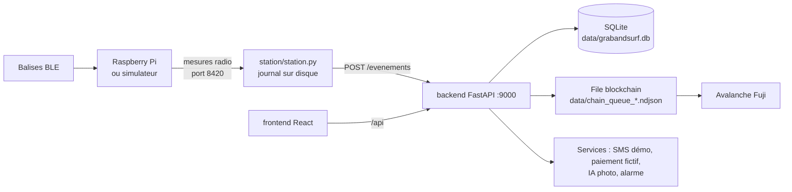
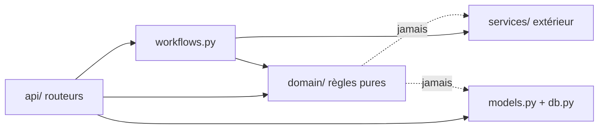

# Grab&Surf : architecture technique

Sep 25, 2026 · Document technique de référence, aligné sur le code de la branche `chore/architecture`

Le brief projet (`docs/BRIEF.md`) dit **quoi** et **pourquoi** ; ce document dit **comment**. Les règles de travail sont dans `CLAUDE.md`. En cas d'écart, le code fait foi et ce document doit être corrigé.

## En bref

Un backend **Python FastAPI** avec une base **SQLite via SQLAlchemy 2**, un frontend **React 18 (Vite, Tailwind)**, une couche **blockchain Avalanche** écrite en arrière-plan, et le code **station** issu du kit. Tout le code est en anglais ; les textes affichés sont en français. **La blockchain est l'infrastructure, pas le produit.**

| Brique | Choix | Raison en une ligne |
| --- | --- | --- |
| Backend | Python 3.12, FastAPI, Uvicorn | Le kit, la station et web3 sont déjà en Python ; routeurs par domaine, doc d'API automatique, client de test pour l'e2e |
| Base de données | SQLite + SQLAlchemy 2 (ORM typé) | Zéro installation ; passage à PostgreSQL en changeant `DATABASE_URL` |
| Migrations | Aucune pendant le hackathon | Tables créées au démarrage, `seed.py` recrée une démo propre ; Alembic en production |
| Frontend | React 18 + Vite + React Router, JavaScript | Une seule app pour les 4 interfaces, mobile d'abord |
| Styles | Tailwind CSS 3 | Thème liège et océan, rapide à écrire |
| Serveur Node | Aucun | Vite ne sert qu'au développement ; le backend sert `frontend/dist` en démo |
| Temps réel | Rafraîchissement toutes les 2 s | Plus simple et plus robuste que des WebSockets |
| Blockchain | Avalanche Fuji, ERC-721, web3.py | Déjà déployé et vérifié ; l'usager ne signe rien |
| IA photo | Claude vision (`claude-opus-5`, sortie JSON structurée) si `ANTHROPIC_API_KEY`, sinon simulation | Diagnostic réel en démo, et la location ne dépend jamais du réseau |
| QR codes | `jsqr` (lecture caméra et photo) et `qrcode` (planche à imprimer), côté navigateur | Rien à installer côté serveur, lecture sur le téléphone |
| Langues | FR, EN, ES pour les pages client (`src/i18n.jsx`) et les erreurs et SMS (`backend/app/i18n.py`) | Touristes étrangers sur la côte basque |
| Tests | unittest + client de test FastAPI | Rien à installer côté tests ; l'e2e rejoue la démo |
| CI | GitHub Actions | Tests Python, build du front et contrôle des tirets cadratins à chaque PR |

## Vue d'ensemble



La station décide seule (départ, retour) et pousse ses événements au backend. Le backend est la seule source de vérité applicative ; il écrit sur la chaîne en arrière-plan, sans jamais faire attendre une location. Le front ne parle qu'au backend.

**Ports** : simulateur 8080 (contrôle) et 8420 (flux), backend 9000, Vite 5173 en développement (redirige `/api` et `/evenements` vers 9000).

## Arborescence du dépôt

```
grabandsurf/
├── CLAUDE.md                  règles de travail (humains et Claude Code)
├── README.md                  installation et commandes
├── config.json                tarifs, minuteries, cagnotte, packs, stations (centimes, aucun secret)
├── env.example                modèle du .env (le .env n'est jamais committé)
├── docs/                      BRIEF, ARCHITECTURE, BLOCKCHAIN, VISILY_PROMPTS, NIGHT_LOG, ARCHIVES/
├── korko-kit/                 kit des organisateurs : LECTURE SEULE
├── backend/
│   ├── requirements.txt
│   ├── app/
│   │   ├── main.py            create_app() : routeurs, services, build du front
│   │   ├── settings.py        lit config.json, .env et l'environnement (anciens noms acceptés)
│   │   ├── db.py              moteur, sessions, création des tables, horloge du flux
│   │   ├── models.py          tables
│   │   ├── schemas.py         formats JSON des requêtes (Pydantic)
│   │   ├── deps.py            session, services, jeton client, PIN exploitant
│   │   ├── workflows.py       orchestration partagée : événements station, clôture, cagnotte, lignes chain
│   │   ├── domain/            règles pures : pricing, fleet, wallet, packs, missions
│   │   ├── services/          sms, payment, photo_ai, alarm, chain (chacun avec une version factice)
│   │   └── api/               stations, customers, rentals, partners, fleet, photos, passport
│   ├── chain/
│   │   ├── contract/          KorkoPlanche.sol, ABI compilée, standard-input.json
│   │   ├── deployment.json    contrat d'équipe (public, versionné)
│   │   ├── ambassadors.json   ambassadeurs fictifs des passeports
│   │   └── scripts/           create_wallet.py, deploy.py, grant_operator.py
│   ├── scripts/seed.py        données de démo
│   └── tests/                 unit/ (domaine, chaîne, station) et e2e/test_demo_scenario.py
├── station/station.py         journal sur disque, reprise du dernier état, alarme
├── frontend/src/
│   ├── App.jsx  main.jsx      les 4 routes
│   ├── api.js                 le seul endroit qui appelle le backend
│   ├── components/ui.jsx      Button, Card, StatusBadge, Money, SmsInbox, TxLink, usePoll
│   └── pages/                 client/  passport/  operator/  partner/
├── scripts/dev.sh             simulateur, backend, front, station
├── scripts/check_em_dash.py   contrôle des tirets cadratins (CI)
└── data/                      base SQLite, photos, journaux (ignoré par git)
```

`workflows.py` n'était pas prévu au cadrage : il porte ce que plusieurs routeurs partagent (traiter un événement station, clôturer une location, créditer la cagnotte, préparer une écriture on-chain), pour que les routeurs ne s'appellent jamais entre eux.

| Dossier ou fichier | Propriétaire |
| --- | --- |
| `api/customers.py`, `api/rentals.py`, `api/partners.py`, `domain/pricing.py`, `domain/wallet.py`, `domain/packs.py`, `services/sms.py`, `services/payment.py`, `pages/client/`, `pages/partner/`, `station/` | Dev1 |
| `api/stations.py`, `api/fleet.py`, `api/photos.py`, `api/passport.py`, `domain/fleet.py`, `domain/missions.py`, `services/photo_ai.py`, `services/alarm.py`, `services/chain.py`, `backend/chain/`, `pages/operator/`, `pages/passport/` | Dev2 |
| `models.py`, `schemas.py`, `main.py`, `workflows.py`, `App.jsx`, `api.js`, `components/`, `config.json` | **Partagés** : toute modification est annoncée à l'autre |

## Couches du backend



1. **domain/** ne fait ni réseau, ni base, ni lecture d'horloge système. Ses fonctions reçoivent l'état, la configuration et l'heure `t` du flux, et renvoient une décision.
2. **services/** encapsule ce qui peut tomber. Chaque service a une version factice ; `main.build_services()` choisit, et les tests peuvent en injecter d'autres via `create_app(settings, services)`.
3. **api/** orchestre : lit la base, appelle le domaine et `workflows.py`, écrit en base.
4. Une requête invalide renvoie 400, 401 ou 404 avec `{"detail": "message clair"}`, jamais 500. `POST /evenements` répond toujours 200 (avec `errors`) pour que le journal de la station ne se bloque jamais sur une ligne illisible.

**L'heure** : jamais `time.time()` dans la logique métier. L'horloge est le plus grand `t` reçu des stations (`app_state.clock`) ; les actions client (armer une location, code SMS, retour par QR) sont datées avec cette horloge.

**Écritures on-chain** : une ligne `chain_txs` est créée dans la transaction de la requête, puis l'événement est publié **après le commit** (`deps.get_db`). Le service met la ligne à jour (`sent` avec le hash, ou `rejected`).

## Base de données

SQLite dans `data/grabandsurf.db` (ou `DATABASE_URL`). **Montants en centimes (entiers)**, heures en secondes de flux (`_t`).

| Table | Colonnes principales |
| --- | --- |
| `app_state` | key, value (horloge du flux) |
| `stations` | id, name, last_seen_t, offline_alerted |
| `boards` | id (korko-01…), token_id, home_station, current_station, status, status_t, rentals_count, needs_review |
| `customers` | id, phone (unique), referral_code (unique), referred_by_id, sponsor_rewarded, card_hold_status, card_last4, lang |
| `otp_codes` | phone, code, expires_t, used |
| `rentals` | id, customer_id, board_id, suggested_board_id, start_station, end_station, armed_t, start_t, end_t, status, return_mode, pack_code_id, pack_minutes, gross_cents, price_cents, wallet_used_cents, charged_cents, reminder_sent, deposit_status, deposit_due_t, checked_role |
| `card_holds` | id, customer_id, rental_id, amount_cents, captured_cents, status (authorized, captured, released) |
| `wallet_ledger` | id, customer_id, amount_cents (+/-), reason (photo, referral_guest, referral_sponsor, rental_discount), rental_id |
| `photos` | id, rental_id, board_id, sha256, path, ai_result (JSON), rewarded, validated |
| `damage_reports` | id, board_id, rental_id, zone, severity, description, source (customer, photo_ai, inspection), photo_id, status, suggested_fee_cents, fee_cents, charged, reviewer_role |
| `inspections` | id, board_id, kind, **role** (jamais de nom), t |
| `repair_fees` | zone, label, fee_cents (grille du propriétaire, conservée à la remise à zéro) |
| `partners`, `packs`, `pack_codes` | partenaire ; pack (heures, prix) ; codes (quota et minutes utilisées) |
| `station_events` | station, board_id, type, t ; **unique (station, board_id, type, t)** = anti-doublon |
| `alerts` | kind (theft, not_returned, station_offline, damage, unknown_board), board_id, station, message, resolved |
| `sms_messages` | phone, text, t (boîte SMS de démo) |
| `chain_txs` | board_id, rental_id, event_type, station, t, tx_hash, status |

**Statuts de planche** : `at_rack`, `at_sea`, `away_from_home`, `unauthorized` (sortie sans client), `not_returned`, `workshop`, `lost`, `sold`.
**Statuts de location** : `armed`, `active`, `not_returned`, `returned`, `bought` (achat implicite), `cancelled`.

## API

La doc interactive est sur `http://localhost:9000/docs` : **c'est le contrat entre front et back**.

**Protocole station, inchangé** : `POST /evenements`, une ligne JSON ou plusieurs, `{"t", "station", "balise", "evenement"}` avec DEPART, RETOUR, ETRANGERE ou TIC. Réponse `{"ok": true, "processed": n, "duplicates": d}`, plus `"alarm": ["korko-02"]` quand une planche part sans location.

| Méthode et chemin | Rôle |
| --- | --- |
| `GET /api/stations`, `GET /api/stations/{id}` | Nom, en ligne ou non, planches disponibles, téléphone de l'exploitant |
| `GET /api/clock` | Horloge du flux |
| `POST /api/otp` | Code SMS `{phone}` (renvoyé aussi en mode démo) |
| `POST /api/otp/verify` | `{phone, code, referral_code?}` → jeton client signé (HMAC) et profil |
| `POST /api/card-holds` | Carte fictive `{card_number}` |
| `GET /api/me` | Cagnotte, code de parrainage, location en cours, historique |
| `GET /api/sms?phone=` | Boîte SMS de démo |
| `POST /api/rentals` | Armer `{station, pack_code?}` → planche proposée ; empreinte de 300 € |
| `GET /api/rentals/current`, `GET /api/rentals/{id}` | Statut, durée et prix en direct, reçu |
| `POST /api/rentals/{id}/cancel` | Annuler tant que la planche n'est pas partie |
| `POST /api/rentals/{id}/manual-return` | Retour de secours `{rack_station, board_qr}` |
| `POST /api/photos` | Photo de retour `{rental_id, board_qr, image_base64, damage_zone?}` → diagnostic, +1 € |
| `POST /api/damage-reports` | Signaler une casse `{board_id, zone}` |
| `POST /api/damage-reports/{id}/review` | Exploitant : `{decision: confirm|reject, role}` |
| `GET /api/photos`, `GET /api/photos/{id}/image` | Exploitant : photos de retour, diagnostic IA et suggestion de réparation |
| `GET /api/inspections` | Sessions dont la caution attend la vérification |
| `POST /api/rentals/{id}/release-deposit` | Valider l'état et libérer la caution `{role}` |
| `POST /api/rentals/{id}/withhold` | Retenir un forfait `{role, zone, severity, fee_cents?, send_to_workshop?}` |
| `GET /api/repair-fees`, `PUT /api/repair-fees` | Grille des forfaits du propriétaire |
| `GET /api/qr-codes` | Racks et planches à imprimer en QR |
| `GET /api/boards/{id}/passport` | Carnet de vie, minutes surfées, réparations, preuves, ambassadeur |
| `GET /api/fleet` | Exploitant : planches, stations, alertes, missions, CA, locations, blockchain |
| `GET /api/missions`, `GET /api/chain` | Les 3 missions ; état de la blockchain |
| `POST /api/boards/{id}/confirm-loss` | Exploitant : perte confirmée `{role}` → achat implicite |
| `POST /api/boards/{id}/back-in-service` | Remise en service `{role}` (REPARATION on-chain si elle sortait de l'atelier) |
| `POST /api/alerts/{id}/resolve`, `POST /api/fleet/reset` | Alerte traitée ; remise à zéro de la démo |
| `GET /api/partners`, `POST /api/partners/{id}/packs`, `GET /api/partners/{id}/dashboard` | Packs d'heures et tableau partenaire |

**Authentification de démo** : le client reçoit un jeton signé après le code SMS (clé `SECRET_KEY` dans `.env`), gardé dans le navigateur. Les pages exploitant et partenaire demandent un PIN seulement si `OPERATOR_PIN` est défini dans `.env`.

## Règles métier codées

| Règle | Où | Valeur (config.json) |
| --- | --- | --- |
| Prix | `domain/pricing.price_cents` | 0,20 €/min par minute entamée, forfait journée 30 € par 24 h, jamais au-dessus de la caution (300 €) |
| Ordre de facturation | `domain/pricing.quote` | minutes du pack d'abord, puis prix, puis cagnotte |
| Rappel SMS | `pricing.reminder_due` | après `reminder_after_s` (600 s en démo) |
| **Caution après retour** | `workflows.release_deposit`, `withhold_repair` | prix prélevé au retour, le reste attend la vérification : libération par l'exploitant, à la location suivante sans signalement, ou après `deposit_release_after_s` (8 h) |
| Forfait de réparation | `domain/repairs` | grille par zone (`repair_fees`) x gravité (`repairs.severity_percent`), plafonné à la caution restante |
| **Seuil de non-retour** | `pricing.not_returned` | après `not_returned_after_s` (1800 s) : statut « non rendue », alerte, SMS ; **aucun prélèvement** |
| **Achat implicite** | `POST /api/boards/{id}/confirm-loss` | seulement après confirmation de l'exploitant : caution capturée, planche vendue, PERDUE on-chain |
| Location armée | `workflows.run_timers` | annulée après `armed_valid_s` (300 s) si aucune planche ne part |
| Station hors ligne | `fleet.station_online` | pas de message depuis `station_offline_after_s` (60 s de flux) |
| Photo de retour | `wallet.photo_reward_cents` | 1 € par location terminée, seulement si le QR lu est celui de la planche |
| Parrainage | `wallet` | code `SURF-XXXX` aléatoire ; 2 € au filleul à l'inscription, 2 € au parrain après la 1re location terminée du filleul, 10 parrainages maximum |
| Packs | `domain/packs` | 12 €/h moins 20 % ; codes `MAIF-XXXX` ; code de démo `MAIF-SURF` |
| Missions | `domain/missions` | au plus 3 phrases : sortie sans client, non rendue, casse à valider, station hors ligne, rapatriement, rotation d'usure, tournée |
| Inspection | `inspections`, `damage_reports.reviewer_role` | le **rôle** du validateur, jamais son nom |

## Frontend

| Route | Interface |
| --- | --- |
| `/s/:station` | Client : inscription (code SMS affiché en démo), carte fictive, louer avec code pack facultatif, session en direct, reçu, photo, cagnotte, parrainage et partage, boîte SMS de démo, retour de secours |
| `/p/:board` | Passeport : sessions, minutes surfées, réparations, carnet de vie avec preuves, ambassadeur fictif, partager, photo de retour, rendre la planche, signaler une casse |
| `/operator` | Exploitant : missions, CA, stations, alertes (bip sonore activable), planches colorées par statut, casses à valider, confirmer une perte, remettre en service, blockchain et liens, remise à zéro |
| `/operator/inspection` | Inspection : photos et diagnostics, casses, libérer la caution ou retenir un forfait |
| `/owner` | Propriétaire : planche de QR à imprimer, grille des forfaits de réparation |
| `/partner/:id` | Partenaire : heures achetées et utilisées, sessions, personnes, codes, preuves ; jamais de nom |

`src/api.js` est le seul fichier qui appelle le backend. En démo, `scripts/dev.sh --build` compile le front et le backend le sert sur le port 9000.

## Blockchain (technique)

- Fuji C-Chain, chain id 43113. Contrat d'équipe `0x2E802fE90a880f2189A5a85C5562947D8a542302`, vérifié sur Snowtrace.
- Types : MISE_EN_SERVICE 0, DEPART 1, RETOUR 2, ETRANGERE 3, REPARATION 4, RECONDITIONNEMENT 5, PERDUE 6.
- `CHAIN_MODE` : `auto` (réel si `OPERATOR_KEY` existe, sinon simulation), `team`, `personal`, `fake`, `off`. Anciens noms acceptés : `KORKO_CLE_OPERATEUR`, `KORKO_CONTRAT`, `KORKO_MODE=equipe`, `KORKO_RPC`, `KORKO_CHAIN_ID`, `KORKO_EXPLORATEUR`.
- Mode réel : file sur disque par contrat, lots de 20, renvois espacés ; une erreur de connexion au démarrage bascule en simulation, affichée comme telle.
- Scripts : `python -m backend.chain.scripts.create_wallet`, `deploy` (`--force`, `--team`), `grant_operator 0x... [--check|--remove]`.
- Transfert du NFT au client (M8) : `transferFrom` standard, possible avec le contrat actuel ; pas encore codé.

## Station

- `station/station.py` part de `korko-kit/station_exemple.py` (le kit est importé, jamais modifié).
- Chaque événement est écrit dans `data/station_<X>.ndjson` **avant** l'envoi et retiré après la réponse du backend ; envoi dans l'ordre, reprise au TIC suivant en cas d'échec.
- Les planches présentes sont gardées dans `data/station_<X>.state.json` : au redémarrage, reprise du dernier état connu.
- Si la réponse contient `alarm`, la station sonne (cloche du terminal et son ; buzzer GPIO sur le Pi).

## Tests et intégration continue

- `python -m unittest discover -s backend/tests -t .`
- `unit/` : pricing, fleet, wallet, packs, missions, chain (anciens et nouveaux noms), station (journal, reprise, alarme).
- `e2e/test_demo_scenario.py` : inscription avec parrainage, code MAIF, départ, vol et alarme, doublon ignoré, rappel, retour, reçu, photo +1 €, passeport, exploitant, partenaire, non-retour puis perte confirmée, retour par QR, casse validée par rôle, station hors ligne, PIN, remise à zéro.
- GitHub Actions (`.github/workflows/tests.yml`) : tests Python 3.12, contrôle des tirets cadratins, build du front.

## Environnement et commandes

- Python 3.12 (`python3.12 -m venv .venv`), Node 20 ou plus récent.
- `pip install -r backend/requirements.txt` et `npm install` dans `frontend/`.
- Lancement : `scripts/dev.sh` ; backend seul : `uvicorn backend.app.main:create_app --factory --port 9000`.
- Secrets uniquement dans `.env` (clé opérateur, `SECRET_KEY`, `OPERATOR_PIN`) ; jamais committé.

## Priorités des modules

| Module | Priorité | État |
| --- | --- | --- |
| M1 Location client | **P0** | Codé et testé |
| M5 Tableau exploitant | **P0** | Codé et testé |
| M7 Robustesse | **P0** | Codé et testé (anti-doublon, hors ligne, alarme, journal station) |
| M4 Passeport | P1 | Codé (historique depuis `chain_txs`, état on-chain en mode réel) |
| M2 Photo de retour | P1 | Codé avec IA simulée |
| Parrainage | P1 | Codé |
| M6 Packs partenaires | P2 | Codé |
| M3 Retour par QR | P2 | Codé |
| M8 Achat implicite et NFT | P2 | Achat après confirmation codé ; transfert du NFT à faire |
| M9 Contrat V2 | P2 | Non commencé |

## Questions techniques ouvertes

| Question | Hypothèse par défaut |
| --- | --- |
| Historique du passeport par `get_logs` directement sur la chaîne | Aujourd'hui lu dans `chain_txs` (hash réels vérifiables) ; `get_logs` par tranches de 2 000 blocs si le temps le permet |
| Upload de photo en multipart | JSON base64 pour éviter une dépendance de plus (`python-multipart`) |
| Modèle Claude pour la photo | Service factice ; brancher un modèle rapide avec vision dans `services/photo_ai.py` |
| Contrat V2 | Non, sauf décision de l'équipe |
