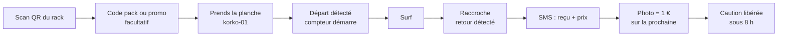

# Grab&Surf : brief projet

Sep 25, 2026 · Document de travail, à valider par l'équipe

## En bref

Grab&Surf (le service appelé KORKO dans le brief de Green Wave) loue des planches de surf en liège sans personne sur la plage : on scanne un QR, on prend la planche indiquée, on la raccroche, c'est fini. Notre équipe ajoute une idée centrale : **chaque planche a une mémoire infalsifiable**, son carnet de vie sur la blockchain Avalanche (départs, retours, casse, réparations, heures surfées).

Cette mémoire sert trois usages concrets : dissuader le vol, trancher les litiges de caution avec la photo de retour, et prouver aux partenaires les heures de sport qu'ils financent. L'usager ne voit jamais la blockchain : pas de wallet, pas de signature, pas de frais.

**Phrase de pitch** : « Grab&Surf loue des planches sans personne sur la plage, et c'est la planche elle-même qui garde la preuve de tout ce qui s'est passé. »

**Contraintes de réalisation** : 6 heures avant le pitch, 2 développeurs avec Claude Code, 2 équipiers non développeurs, pitch de 5 minutes avec démo en direct sur la maquette.

## Contexte et enjeux

**Le défi** : KORKO est développé par Green Wave SAS (Anglet), fabricant des planches en liège NOTOX, pour le hackathon du SHAKA Festival (Biarritz). Le patron de Notox veut des solutions **simples et pas chères**.

**Ce que le jury attend** (restitution, extrait du brief) :

- 5 minutes par équipe.
- « Une maquette qui se clique, un algorithme qui tourne sur des données ou une page de vente prête à envoyer valent mieux qu'une présentation d'intentions. »
- Une question reviendra toujours : **qu'est-ce qui casse en premier, et que se passe-t-il à ce moment-là ?**

**Le sponsor** : le hackathon est sponsorisé par Avalanche (AVAX). Un usage utile et démontrable de la blockchain rapporte des points.

**Ce que le brief a déjà tranché** (à respecter) :

- Pas de serrure, casier ni borne. Pas d'application native : QR code, web, SMS.
- Une balise BLE par planche (passive, pile \~10 ans), rien d'autre à bord. Un Raspberry Pi par station, une seule radio.
- Pas de GPS. Départ et retour sont **détectés, jamais déclarés**.
- Caution pré-autorisée d'environ le prix d'une planche équipée, non débitée.
- Planches abîmées réparées puis remises en service.
- 2 gestes ou moins pour partir surfer une fois inscrit. En panne, le service dégrade, il ne bloque pas. Une tournée humaine par jour.

**Limite physique essentielle** : la station n'entend une balise qu'à quelques mètres. Une fois la planche partie, on ne sait plus rien d'elle jusqu'à son retour. Le système sait qu'une planche est partie, jamais où elle est.

**Les 7 pistes du brief** que nous couvrons : 3 (antivol immatériel), 4 (communauté, photo de retour), 6 (partenaires à impact), avec des éléments de 1 (parcours), 5 (tableau de bord exploitant) et 7 (mode dégradé).

## Notre originalité

Notre différence tient en une idée, **la planche qui se souvient**, déclinée en sept points que nous mettons en avant au jury.

| # | Ce qui nous différencie | Pourquoi c'est fort |
| --- | --- | --- |
| 1 | **Chaque planche est un NFT avec son carnet de vie on-chain** | Identité et historique infalsifiables. Déjà déployé et vérifié sur Avalanche Fuji. |
| 2 | **La blockchain sans wallet** | L'usager ne signe rien et ne paie aucun frais : c'est le cloud qui écrit. On respecte la règle des 2 gestes du brief. |
| 3 | **La photo de retour devient une preuve** | Son empreinte (hash) est inscrite sur la chaîne : personne ne peut prétendre qu'elle a été retouchée. Elle tranche les litiges de caution et rapporte 1 € au client. |
| 4 | **Le vol converti en vente, pour de vrai** | Quand la location atteint le prix de la planche, elle est achetée : caution prélevée et **NFT transféré au client**. C'est le « script de conversion d'un vol en vente » demandé par la piste 3. |
| 5 | **Des heures de surf offertes et certifiées** | Une entreprise, la MAIF ou une mairie achète un pack d'heures, distribue des codes, et suit l'usage prouvé on-chain pour son rapport RSE. |
| 6 | **L'âme de la planche** | Le QR gravé ouvre son passeport public : histoire, ambassadeur, partage sur les réseaux. Une pub virale gratuite. |
| 7 | **Un modèle Notox matériel + abonnement pour les écoles de surf** | Le prof reste dans l'eau avec ses élèves, les planches se louent seules. Le loueur local devient client au lieu d'être concurrent. |

**Ce qui rend l'ensemble crédible** : tout reste simple et bon marché (un QR gravé au laser, un buzzer, un module horloge à quelques euros), et rien ne bloque la location si le réseau ou la blockchain tombent.

## Le produit : 4 acteurs, 4 interfaces

Le client utilise une page web mobile ouverte par QR code. Les trois autres acteurs ont chacun un tableau de bord d'une page.

| Acteur | Qui | Interface | Ce qu'il fait |
| --- | --- | --- | --- |
| **Client** | Surfeur local ou touriste | Page web mobile (QR du rack et QR de la planche), SMS | S'inscrit une fois, loue en 2 gestes, rend la planche, prend la photo, signale une casse |
| **Exploitant** | Qui fait la tournée : Notox ou une école de surf | Tableau de bord d'une page + SMS | Voit les stations en temps réel, reçoit les alertes, exécute 3 missions par jour, valide les diagnostics de casse |
| **Propriétaire** | Notox / Green Wave | Vue parc (pitch, même tableau de bord pour la démo) | Suit tout le parc, prévoit réparations et remplacements, vend matériel et abonnement |
| **Partenaire** | Entreprise, MAIF, mairie, comité d'entreprise | Tableau de bord partenaire | Achète un pack d'heures, distribue des codes, suit l'usage certifié on-chain |

### Parcours client

**Une seule fois** : scan du QR du rack, numéro de téléphone, code reçu par SMS, carte bancaire (empreinte de 300 €, jamais débitée sauf non-retour). Pas de mot de passe, pas d'e-mail, pas de compte Google : **le numéro de téléphone est le compte**.

**À chaque session** :

Le client ne confirme rien au retour : raccrocher suffit. Chaque étape de départ et de retour est inscrite sur la chaîne.

**Parcours de secours** (panne du Pi, balise muette, SMS jamais reçu) : scan du QR du rack, puis du QR gravé sur la planche, puis photo. Les deux QR ensemble prouvent que la planche est à la station. La session se ferme, sans facturer au-delà de ce retour.

**Signaler une casse** : scan du QR de la planche, zone touchée, photo. Le loueur suivant qui constate un défaut a 5 minutes pour le signaler et reposer la planche (pitch).

### Exploitant

- État de chaque planche en temps réel : au rack, en mer, hors base, en atelier, perdue, muette.
- Alertes par SMS et dans la page : sortie sans client (vol), station hors ligne, balise muette, casse signalée, non-retour.
- **3 ordres de mission par jour, chacun expliqué en une phrase** (exigence de la piste 5). Exemple : « Rapatrier korko-02 de B vers A : elle y a été rendue ce matin. »
- Validation ou refus du diagnostic de l'IA sur une photo de casse : **l'IA propose, l'exploitant décide**.
- Liste des locations, durées et chiffre d'affaires.
- Un numéro de téléphone affiché sur le panneau du rack pour qu'on puisse l'appeler.

### Propriétaire (Notox)

Notox suit tout le parc, reçoit les besoins de réparation et prévoit l'envoi d'une planche de remplacement. Pour la démo, c'est le même tableau de bord que l'exploitant ; la séparation des deux rôles est un argument du pitch (modèle école de surf).

### Partenaire

Voir les règles des packs d'heures dans la section suivante.

## Règles métier

Les montants marqués « hypothèse » sont à fixer dans le back-office ; le code doit les lire dans une configuration, jamais en dur.

| Règle | Valeur | Source ou statut |
| --- | --- | --- |
| Tarif | 0,20 €/min, soit 12 €/h | Signalétique du brief |
| Plafond | 3 h en réel, **10 min en démo** : SMS de rappel, puis forfait journée ou tarif majoré selon la décision de l'équipe, le compteur continue | Brief (« avec un plafond ») ; question ouverte, voir la fin du document |
| Caution | Empreinte bancaire de 300 € (« environ le prix d'une planche équipée »), jamais débitée sauf non-retour | Brief ; montant = hypothèse |
| Paiement de la location | Prélevé au retour ; le reste de l'empreinte est libéré **sous 8 h au plus**, une fois l'état validé | Notre choix |
| Validation de l'état | Photo de retour validée, OU location suivante sans signalement, OU inspection de la tournée | Notre choix |
| Forfaits réparation | Retenus sur la caution selon une grille (aileron, nose, rail, choc) après validation par l'exploitant | Grille à fixer |
| **Achat implicite** | Quand le montant cumulé de la location atteint le prix de la planche, elle est achetée : caution prélevée, **NFT transféré au client** | Notre règle ; exemple : avec un forfait journée de 30 €, 300 € sont atteints en 10 jours |
| Garde-fou achat implicite | Aucun prélèvement de caution tant que la tournée n'a pas vérifié le rack, ou qu'il n'y a pas eu de retour par QR : une balise morte ressemble à un non-retour | Notre règle |
| **Cagnotte photo** | 1 photo de retour = 1 € déduit de la prochaine session. 1 € par session maximum, seulement si le QR de la bonne planche est visible | Remplace les « tubes » du brief |
| Interdit | Ne jamais récompenser le temps passé à l'eau | Brief : pousserait à monopoliser une planche |
| **Pack d'heures** | Une organisation achète N heures (12 €/h moins une remise volume, hypothèse −20 %), reçoit des codes, chaque code donne un quota de minutes | Notre offre partenaire |
| Données partenaire | Chiffres agrégés et usage par code ; **jamais de nom** de salarié ou d'usager | RGPD |
| Vol | Planche qui quitte le rack sans session armée : alarme sonore du Pi, alerte exploitant, statut « sortie sans client » on-chain | Notre choix (voir décisions) |

**Parrainage, sans compte** : chaque personne qui donne son numéro reçoit un code de parrainage affiché dans l'interface. Le code est aléatoire (`SURF-7K2P`) et ne contient jamais le numéro. Il alimente la même cagnotte que la photo : hypothèse 2 € pour le parrain et 2 € pour le filleul. Le parrain n'est crédité qu'après la première location terminée du filleul, avec un plafond de parrainages par numéro (anti-fraude).

**Le parc de la maquette** : trois stations A, B, C avec deux planches chacune (korko-01 et 02 à A, 03 et 04 à B, 05 et 06 à C). Une planche rendue à une autre station est « étrangère » : le cloud crée une mission de rapatriement.

## Robustesse : ce qui casse, et ce qui se passe alors

**Ce qui casse en premier : la détection radio.** Un corps mouillé devant la balise ou une planche posée sur le sable à six mètres, et la station annonce un faux départ ou un faux retour. Notre réponse, prête pour le jury :

1. On ne déclare un départ que sur un silence confirmé dans la durée, jamais sur une mesure isolée.
2. L'exploitant corrige une erreur depuis son tableau de bord ; le client peut l'appeler (numéro sur le panneau).
3. Une correction s'ajoute sur la chaîne comme un nouvel événement : **on n'efface jamais**, l'erreur et sa correction restent visibles.

### Tous les cas prévus

| Problème | Ce qui se passe | Statut |
| --- | --- | --- |
| **Non-retour** | SMS au plafond, forfait journée ou tarif majoré, puis achat implicite (caution prélevée, NFT transféré), avec le garde-fou tournée | Statut PERDUE codé ; transfert NFT à coder |
| **Casse signalée** | Photo, diagnostic IA, validation par l'exploitant, forfait retenu ; la planche passe « en atelier » et n'est plus proposée | À coder |
| **Casse non signalée** | Imputée au dernier loueur, sauf si sa photo de retour (empreinte on-chain) prouve le bon état. Détectée par le loueur suivant ou par la tournée | Pitch ; empreinte en V2 |
| **Vol** (départ sans session) | Alarme sonore du Pi (en démo : le son de l'ordinateur), alerte exploitant, statut « sortie sans client ». Le QR gravé dit « planche Grab&Surf, ramène-la » ; la revente est difficile car le registre est public | Alerte codée ; alarme à coder |
| **Coupure réseau** | La station décide seule, écrit ses événements sur disque et les envoie dans l'ordre au retour du réseau. Le cloud facture sur l'heure `t` de l'événement, pas sur son heure de réception : une coupure de 6 h ne change pas le prix | Cloud codé ; journal sur disque de la station à coder |
| **Doublons après coupure** | Le cloud ignore un événement déjà reçu (clé : station, planche, heure, type) | À coder |
| **Blockchain ou Fuji indisponible** | File d'attente sur disque, une par contrat, renvois espacés, lots de 20 ; la location n'attend jamais la chaîne | Codé et testé |
| **Crash et redémarrage du Pi** | Redémarrage automatique (systemd), relecture du journal, reprise depuis le dernier état connu (et non « toutes les planches présentes ») | À coder |
| **Horloge du Pi fausse après redémarrage hors réseau** | Le Pi n'a pas d'horloge qui tient sans courant : module RTC à environ 5 € | Matériel, pitch |
| **Batterie du Pi à plat** | Le cloud ne reçoit plus les battements (TIC) : station déclarée hors ligne, alerte. Les compteurs tournent côté cloud ; le client rend par QR ; jamais facturé au-delà de son retour | À coder (hors ligne + retour QR) |
| **Balise morte au rack** | Planche présente mais muette : ressemble à un départ sans session qui ne revient pas. Mission : « Vérifier korko-03, muette depuis 2 h » | Mission à coder |
| **Balise morte pendant une location** | Impossible à distinguer d'un non-retour : le client rend par QR du rack + QR de la planche + photo ; garde-fou avant tout prélèvement. L'âge de la balise est on-chain, remplacement préventif vers 8 ans | Retour QR à coder |

### Les 4 priorités de robustesse à coder (environ 2 h)

1. Journal de la station sur fichier et démarrage depuis le dernier état connu.
2. Détection « station hors ligne » dans le cloud, et anti-doublon.
3. Alarme de vol (buzzer du Pi, ou son de l'ordinateur en démo).
4. Retour déclaratif par QR du rack + QR de la planche + photo : il couvre à lui seul la panne, la balise morte et les litiges de casse.

## Blockchain

La blockchain sert quand **un tiers doit vérifier sans nous faire confiance** : le partenaire qui finance des heures, le client qui conteste une retenue sur caution, l'acheteur d'une planche d'occasion. C'est notre réponse à la question « pourquoi pas une simple base de données ? ».

### Ce qui est déjà en place

- Réseau : Avalanche **Fuji C-Chain** (testnet, chain id 43113).
- Contrat d'équipe KorkoPlanche (ERC-721, OpenZeppelin 5, solc 0.8.24) : [0x2E802fE9…8a542302](https://testnet.snowtrace.io/address/0x2E802fE90a880f2189A5a85C5562947D8a542302), **code source vérifié sur Snowtrace**. 6 NFT, un par planche, avec leur station d'origine.
- Coût constaté : environ 0,0000004 AVAX pour 7 transactions.
- L'écriture est automatique : chaque départ, retour, retour étranger ou perte validé par le cloud part sur la chaîne. Les deux développeurs l'ont fait fonctionner avec le Raspberry.

### Ce qui va on-chain, ce qui n'y va jamais

| On-chain | Jamais on-chain |
| --- | --- |
| Numéro de planche (id du NFT) | Téléphone, nom, e-mail du client |
| Type d'événement : mise en service, départ, retour, étrangère, réparation, reconditionnement, perdue | Carte bancaire, montants payés |
| Station et heure `t` du flux | La photo elle-même (seulement son empreinte, en V2) |
| Propriétaire du NFT | Le signal radio brut (RSSI) |

Règle : seuls les événements **validés par le cloud** partent sur la chaîne. Un faux départ inscrit ne s'efface plus : il se corrige par un nouvel événement.

### Qui écrit

- Le contrat n'accepte que les **opérateurs** : le wallet du cloud. Le contrat le vérifie lui-même (`msg.sender`), pas seulement l'interface.
- Le propriétaire du contrat autorise un nouveau wallet en une commande, et peut le retirer si une clé fuite.
- **L'usager ne signe rien.** C'est notre argument « la blockchain sans wallet ».

### Deux contrats : perso et équipe

Chaque développeur teste sur son propre contrat, pour ne pas salir le carnet de vie de la démo. La démo devant le jury tourne sur le contrat d'équipe, celui dont le code est vérifié. Le tableau de bord indique toujours lequel est utilisé. Les commandes sont dans le document d'architecture technique.

### Transférer le NFT au client (achat implicite)

1. La planche passe « vendue » ; le NFT reste chez Grab&Surf, à réclamer.
2. Le client reçoit un SMS : « Cette planche est maintenant à toi. Réclame son NFT : lien ».
3. Sur cette page, il colle l'adresse d'un wallet qu'il a déjà (Core, MetaMask) ; le wallet opérateur, propriétaire des NFT, lui transfère le sien (`transferFrom` standard). **Le contrat actuel le permet déjà, sans V2.**

En démo : transfert vers le wallet Core d'un équipier, Snowtrace montre le nouveau propriétaire. Pour le pitch : plus tard, un wallet créé automatiquement à partir du numéro de téléphone.

### V2 du contrat (facultative, environ 30 min avec redéploiement et vérification)

- Type INSPECTION avec un champ `preuve` (empreinte de la photo de retour).
- Type CORRECTION pour annuler un faux événement sans rien effacer.
- Statut VENDUE.
- Rôles RÉPARATEUR et SPONSOR (idée des notes ChatGPT : c'est le contrat qui vérifie les droits).

### Ce que nous retenons des notes ChatGPT

- **D'accord** : l'app reste le produit ; comptes, photos, données personnelles dans le backend ; identité, historique et preuves sur la chaîne ; si c'est « garanti par la blockchain », c'est le contrat qui le vérifie ; pas d'architecture complexe, on redéploie une V2 si besoin.
- **Pas d'accord** : le wallet utilisateur qui signe chaque action. Ça casse la règle des 2 gestes. Chez nous, l'usager n'a de NFT que s'il achète la planche.

## Le MVP à coder

Neuf modules, classés par priorité : P0 indispensable à la démo, P1 très souhaitable, P2 seulement s'il reste du temps. **Le détail technique (choix de la stack, arborescence, base de données, API, conventions, spécifications par module) est dans le document « Grab&Surf : architecture technique »**, aussi présent dans le dépôt sous `docs/ARCHITECTURE.md`.

| Module | Priorité | Qui | Critère d'acceptation |
| --- | --- | --- | --- |
| M1 Parcours client mobile, avec parrainage | P0 | Dev1 | Du scan au « Prends korko-01 » en 2 gestes une fois inscrit ; reçu et code de parrainage affichés |
| M5 Tableau de bord exploitant | P0 | Dev2 | Une page : planches, alertes, 3 missions expliquées en une phrase |
| M7 Robustesse | P0 | Dev1 (station), Dev2 (serveur) | Coupure réseau puis retour : aucun événement perdu ni doublé ; alarme sur départ sans location |
| M3 Retour par QR de la planche | P1 | Dev1 | Location fermée par QR du rack + QR de la planche + photo |
| M2 Photo de retour et IA | P1 | Dev2 | Diagnostic affiché, 1 € crédité, casse transmise à l'exploitant |
| M4 Passeport public | P1 | Dev2 | Historique on-chain lisible, ambassadeur fictif, bouton partager |
| M6 Packs d'heures partenaire | P1 | Dev1 | Un code offre la session ; tableau partenaire avec liens de preuve |
| M8 Achat implicite et NFT | P2 | Dev2 | Transfert du NFT visible sur Snowtrace |
| M9 Contrat V2 | P2 | Dev2 | Types INSPECTION et CORRECTION, empreinte de la photo |

**Règles qui valent pour tous les modules** : aucune donnée personnelle sur la blockchain ; tous les montants dans un fichier de configuration, jamais en dur ; l'heure de référence est celle du flux des stations ; pages mobiles d'abord, en français et en anglais ; aucun tiret cadratin dans les textes affichés.

## Le panneau du rack

Le panneau remplace l'accueil humain : il doit tout dire, y compris quoi faire en cas de panne. Trilingue français, anglais, espagnol (touristes). Team4 le réalise et l'imprime pour la démo.

1. **Le QR « Louer »**, gros et visible de loin.
2. **Comment ça marche, en 3 pictos** : scanne, prends la planche indiquée, raccroche-la, c'est fini.
3. **Prix** : 0,20 €/min, plafond et tarif au-delà. **Caution** : empreinte de 300 € jamais débitée, sauf si la planche n'est pas rendue.
4. **La photo** : « Prends ta planche en photo au retour : 1 € sur ta prochaine session, et c'est ta preuve qu'elle est en bon état. »
5. **Le secours** : « Pas de SMS de reçu 2 minutes après avoir raccroché ? Scanne le QR du rack puis celui de ta planche. Tu n'es jamais facturé au-delà de ton retour. »
6. **Une casse ?** « Signale-la en scannant ta planche. »
7. **L'avertissement** : « Une planche qui s'éloigne sans location déclenche l'alarme. »
8. **Le téléphone de l'exploitant** et les horaires de passage de la tournée.
9. **L'impact** : « Planche en liège des Landes. Scanne ta planche pour voir son histoire. »

**Sur chaque planche** : numéro peint (déjà prévu par le brief) et QR gravé au laser dans le liège, visible sur les photos de retour. Passif, sans électronique, résistant au sel : compatible avec « 1 composant par planche ». Il empêche de photographier une autre planche que la sienne.

**Slogan possible du panneau** : « Grab. Surf. Raccroche. » (à adapter au nom retenu).

## Décisions et raisons

Trois catégories : ce qui est codé pour la démo, ce qui passe seulement dans le pitch, ce qui est abandonné.

### Retenu et codé

| Décision | Pourquoi |
| --- | --- |
| QR du rack, téléphone, code SMS, empreinte bancaire | C'est le parcours du brief, en 2 gestes une fois inscrit |
| Le numéro de téléphone est le compte | Le brief exclut mot de passe et e-mail de confirmation |
| Carnet de vie on-chain, blockchain sans wallet | Preuve pour un tiers, sans ajouter un geste à l'usager |
| Photo de retour, diagnostic IA validé par l'exploitant | Piste 4 (inspection par la communauté). Le brief exige que l'exploitant puisse contredire la machine : jamais de retenue sur la seule décision de l'IA |
| QR gravé au laser sur chaque planche | Empêche de photographier une autre planche, passif, bon marché |
| Cagnotte de 1 € par photo, et parrainage par numéro de téléphone | Plus simple à comprendre que des « tubes » : comme le gobelet consigné. Le parrainage alimente la même cagnotte, sans compte, et rend le service viral |
| Packs d'heures pour les organisations | Offre partenaire simple à expliquer, preuve d'usage on-chain |
| Passeport public et ambassadeur | Pas cher, très démontrable, viral |
| Tableau de bord exploitant avec 3 missions | Exigence de la piste 5 |
| Retour par QR du rack + QR de la planche | Couvre panne du Pi, balise morte, SMS non reçu |
| **Alarme sonore de vol** | **Écart assumé au brief** (qui écarte « ni alarme ») : c'est la protection la moins chère, sans pièce mobile, sans geste pour l'usager honnête. Le patron de Notox veut du simple et pas cher |
| Contrat perso par développeur, contrat d'équipe pour la démo | Tester sans salir le carnet de la démo |

### Seulement dans le pitch

| Idée | Pourquoi pas dans la démo |
| --- | --- |
| Modèle Notox : racks et planches vendus + abonnement pour les écoles de surf, SAV et remplacement | Argument économique, rien à démontrer en code |
| Achat implicite avec transfert du NFT | Codé seulement s'il reste du temps (M8) |
| Loueur suivant qui signale la casse sous 5 minutes | Gestion des litiges trop longue à coder en 6 h |
| Agent IA ou MCP qui répond à l'exploitant sur les données on-chain | Le tableau de bord doit marcher d'abord |
| Codes promo | Même mécanique que la cagnotte ; le parrainage, lui, est codé dans M1 |
| Cagnotte valable au bar de plage partenaire | Une phrase suffit |
| Occasion certifiée (le « Carfax » de la planche) | Deuxième source de revenus pour Green Wave |
| Wallet créé automatiquement à partir du téléphone | Pour réclamer un NFT sans wallet existant |
| Module horloge RTC, buzzer GPIO | Matériel à quelques euros |

### Abandonné

| Idée | Pourquoi |
| --- | --- |
| Les « tubes » comme jeton ou points à collectionner | Le mot n'évoque rien, ça complique ; un jeton échangeable pousse à la spéculation |
| Assurance MAIF qui réduit la caution | Personne ne souscrit une assurance au moment de louer une planche |
| Placer la caution en DeFi pour un rendement | La caution est une pré-autorisation non débitée : il n'y a rien à placer. Sinon : garde de fonds clients (MiCA), risque de perte, rendement nul sur quelques heures |
| Paiement en USDC par défaut | Un wallet obligatoire casse la règle des 2 gestes ; au mieux une option plus tard |
| Wallet utilisateur qui signe chaque action (notes ChatGPT) | Même raison |
| Connexion Google obligatoire | Le téléphone suffit comme compte |
| Données client on-chain | RGPD : la chaîne n'oublie rien |
| Afficher un vrai surfeur connu sans accord | Risque juridique et d'image : ambassadeur fictif ou équipier |

## La démo : une seule histoire en 2 min 30

Une seule histoire continue, jouée en direct sur la maquette : un touriste loue, surfe, rend, et la planche garde la preuve. Tout ce qui n'y entre pas va dans les slides.

| Temps | Ce qu'on montre | Ce que voit le jury |
| --- | --- | --- |
| 0:00 | Scan du QR du rack A, numéro, code SMS, carte fictive | Inscription en moins de 30 s, SMS dans la boîte de démo |
| 0:30 | Saisie d'un code pack MAIF, « Prends korko-01 » | Session offerte par le partenaire |
| 0:45 | Un équipier décroche la planche et s'éloigne | Départ détecté, compteur qui tourne, **transaction sur Snowtrace** |
| 1:05 | Un autre équipier décroche korko-02 sans louer | **L'alarme sonne**, alerte chez l'exploitant |
| 1:20 | korko-01 raccrochée | SMS de reçu, prix, « photo = 1 € » |
| 1:35 | Photo de la planche avec son QR | Diagnostic IA, 1 € crédité, empreinte de la photo |
| 1:50 | Scan du QR gravé sur la planche | Passeport : historique on-chain, ambassadeur, bouton partager |
| 2:05 | Tableau de bord exploitant | Planches, alerte de vol, 3 missions expliquées en une phrase |
| 2:20 | Tableau de bord MAIF | Heures offertes consommées, chacune avec son lien de preuve |

### Rôles pendant la démo

- Un présentateur qui parle et tient le téléphone client.
- Un équipier qui déplace les planches sur la maquette.
- Un équipier aux écrans (Snowtrace, exploitant, MAIF), projetés.

### Check-list avant de monter sur scène

- [ ] Serveur lancé sur le **contrat d'équipe** (mode équipe), le tableau de bord affiche « ÉQUIPE · démo ».
- [ ] Plafond de démo à 10 min, parc remis à zéro, planches au rack.
- [ ] Solde AVAX de test vérifié, file d'attente vide.
- [ ] Station branchée sur la vraie maquette (sinon simulateur prêt en secours).
- [ ] Son de l'ordinateur activé pour l'alarme.
- [ ] Onglets ouverts : page client, Snowtrace du contrat, exploitant, MAIF, passeport.
- [ ] **Vidéo de secours de toute la démo**, enregistrée à l'avance, si le Wi-Fi ou Fuji lâchent.

## Le pitch en 5 minutes

La démo prend la moitié du temps : le jury veut voir ce qui tourne.

| Temps | Partie | Contenu |
| --- | --- | --- |
| 0:00 – 0:30 | Le problème | On loue sans personne sur la plage : qui garantit quoi, quand il n'y a plus personne ? |
| 0:30 – 3:00 | La démo | L'histoire de la section précédente |
| 3:00 – 4:00 | Le modèle | Matériel Notox + abonnement pour les écoles ; packs d'heures partenaires ; occasion certifiée |
| 4:00 – 4:30 | Ce qui casse en premier | La détection radio, et ce qui se passe alors |
| 4:30 – 5:00 | La suite | Ce qu'on demande, la vision |

### Phrases prêtes à dire

- **Accroche** : « Grab&Surf loue des planches sans personne sur la plage, et c'est la planche elle-même qui garde la preuve de tout ce qui s'est passé. »
- **La blockchain sans wallet** : « Le surfeur ne voit jamais la blockchain. Il ne signe rien, il ne paie aucun frais. C'est la planche qui a une identité on-chain, pas lui un wallet. »
- **Pourquoi une blockchain** : « Une base de données, c'est notre parole. La blockchain, c'est une preuve que le partenaire, le client ou un acheteur peuvent vérifier sans nous faire confiance. »
- **Le partenaire** : « Vous offrez 500 heures de surf, la blockchain prouve qu'elles ont été surfées. »
- **La photo** : « Une photo au retour, c'est 1 € pour le client et une preuve infalsifiable de l'état de la planche. »
- **Le vol** : « Une planche qui ne revient pas n'est pas volée : elle est achetée, et son NFT change de propriétaire. »
- **L'alarme** : « On a gardé une alarme sonore, parce qu'elle coûte quelques euros et ne demande aucun geste à l'usager honnête. »
- **Les écoles de surf** : « Le prof reste dans l'eau avec ses élèves, les planches se louent toutes seules. Il économise un salaire. »
- **Ce qui casse en premier** : « La détection radio. Un faux départ ne s'efface pas : il se corrige, et la correction reste visible. Et si le réseau tombe, la station continue seule et rattrape ensuite. »
- **Clôture** : « Chaque planche a une histoire. Nous, on l'écrit. »

### Questions probables du jury

| Question | Réponse courte |
| --- | --- |
| Pourquoi pas une base de données ? | Parce qu'un tiers doit pouvoir vérifier sans nous faire confiance |
| Et le RGPD ? | Aucune donnée personnelle on-chain : planche, station, heure, type d'événement |
| Si Avalanche tombe ? | La location continue ; les événements attendent dans une file et partent ensuite |
| Combien ça coûte ? | Quelques millionièmes d'AVAX par événement sur le testnet ; sur le réseau principal, à chiffrer (question ouverte) |
| Si la balise meurt pendant une location ? | Le client rend par les QR ; aucun prélèvement de caution avant vérification par la tournée |
| L'empreinte bancaire expire ? | Elle tient quelques jours selon le prestataire : largement assez pour une session, et renouvelée sinon |
| L'alarme n'était pas dans le brief ? | Choix assumé : c'est la dissuasion la moins chère, sans geste en plus |

## Répartition de l'équipe

Deux développeurs avec Claude Code, deux équipiers sur le pitch et le physique. Chacun sait ce qu'il livre et à quelle heure.

| Qui | Responsabilité | Livrables |
| --- | --- | --- |
| **Dev1** | Parcours client et station | M1 parcours client mobile et boîte SMS ; M7 côté station (journal sur disque, reprise, buzzer) ; M3 retour par QR ; M6 packs d'heures |
| **Dev2** | Serveur, blockchain et tableaux de bord | M5 tableau exploitant et 3 missions ; M7 côté serveur (anti-doublon, station hors ligne, alarme) ; M2 photo et IA ; M4 passeport ; puis M8 et M9 si le temps le permet |
| **Team3** | Pitch et modèle économique | Deck de 5 minutes ; offre pack d'heures chiffrée comparée à un affichage publicitaire équivalent sur la côte (demandé par la piste 6) ; slide modèle Notox pour les écoles ; réponses aux questions du jury |
| **Team4** | Physique et démo | Panneau du rack imprimé ; QR du rack et des planches imprimés et collés ; contenu ambassadeur fictif (texte, photo) ; script de démo ; tests du parcours en jouant le touriste pressé ; vidéo de secours |

**Points de contact entre développeurs** : chaque développeur possède ses dossiers, et trois fichiers seulement sont partagés (le modèle de données, les formats d'API et l'enregistrement des routes). Le détail est dans le document d'architecture technique. Travail en branches, petites PR relues par l'autre développeur, tests verts avant tout merge : les règles sont dans CLAUDE.md.

## Plan d'actions

H+0 = le moment où l'équipe valide ce document. **Gel des fonctionnalités à H+3:30**, quoi qu'il arrive : après, on ne fait plus que corriger et répéter.

### H+0:00 à H+0:30 : cadrage (toute l'équipe)

- [ ] Valider ce document, ou le corriger en commentaire.
- [ ] Choisir le nom : Grab&Surf ou Take-Off Rack.
- [ ] Décider : contrat V2 (M9) oui ou non.
- [ ] Dev1 et Dev2 : écrire ensemble le modèle de données, les formats d'API et le fichier de configuration (tarifs, plafond, caution, forfaits, remise, parrainage), puis les figer.
- [ ] Dev1 et Dev2 : récupérer la nouvelle arborescence, vérifier que la chaîne simulateur, serveur et station tourne chez chacun sur son contrat perso.

### H+0:30 à H+2:00 : les fondations P0

- [ ] Dev1 : M1 parcours client mobile, boîte SMS de démo et code de parrainage.
- [ ] Dev2 : M5 tableau de bord exploitant et 3 missions.
- [ ] Dev2 : M7 côté serveur (anti-doublon, station hors ligne, alarme avec son sur l'ordinateur).
- [ ] Team3 : squelette du deck, chiffrage de l'offre pack d'heures.
- [ ] Team4 : panneau du rack, QR du rack et des planches.

### H+2:00 : point d'étape (10 minutes)

- [ ] Démo interne de M1 et M5 de bout en bout ; on coupe ce qui ne tiendra pas.

### H+2:00 à H+3:30 : les P1

- [ ] Dev1 : M7 côté station (journal sur disque, reprise, buzzer).
- [ ] Dev1 : M3 retour par QR de la planche, puis M6 packs d'heures.
- [ ] Dev2 : M2 photo et IA, puis M4 passeport public.
- [ ] Dev2 : M9 contrat V2, seulement si décidé à H+0.
- [ ] Team3 : deck version 1, phrases de pitch, réponses aux questions du jury.
- [ ] Team4 : contenu ambassadeur fictif, script de démo, impression du panneau.

### H+3:30 : gel des fonctionnalités et intégration

- [ ] Passage sur le **contrat d'équipe** (mode équipe).
- [ ] Branchement sur la vraie maquette (Wi-Fi de la maquette, stations A, B, C).

### H+3:30 à H+4:30 : corrections

- [ ] Team4 joue le touriste pressé sur toute la démo ; les développeurs corrigent.
- [ ] Dev2 : M8 achat implicite et NFT, seulement si tout le reste est vert.

### H+4:30 à H+5:00 : filet de sécurité

- [ ] Enregistrer la vidéo de secours de la démo complète.
- [ ] Remettre le parc à zéro, vérifier le solde AVAX et la file vide.

### H+5:00 à H+6:00 : répétitions

- [ ] Trois répétitions chronométrées de 5 minutes, avec la check-list de la démo.
- [ ] Une séance de questions du jury jouée par Team3.

## Questions ouvertes

À trancher pendant le cadrage de H+0 ; sans réponse, l'hypothèse indiquée s'applique.

| Question | Hypothèse par défaut |
| --- | --- |
| Nom du projet : Grab&Surf ou Take-Off Rack ? | Grab&Surf |
| Contrat V2 (INSPECTION, CORRECTION, VENDUE) ? | Non, sauf si Dev2 est en avance à H+2:00 |
| Après le plafond : tarif majoré (le brief, pour que la planche revienne vite : une station n'a que 2 planches) ou forfait journée dégressif (les usages des loueurs, pour pouvoir surfer ailleurs) ? | Compromis proposé : 0,20 €/min jusqu'à un forfait journée (hypothèse 30 € par 24 h), SMS à 3 h qui informe sans pénaliser. À trancher par l'équipe |
| Montant de l'empreinte | 300 € |
| Grille des forfaits de réparation | À définir par Team3 avec Notox ; valeurs fictives en démo |
| Remise volume des packs | −20 % |
| Modèle Claude et coût de l'analyse photo | Modèle rapide avec vision ; réponse simulée si pas de clé ou pas de réseau |
| Buzzer disponible sur le Pi de la maquette ? | Non : son de l'ordinateur en démo |
| Exploitant et propriétaire séparés dans l'app ? | Un seul tableau de bord en démo, la séparation dans le pitch |
| Coût sur le réseau principal d'Avalanche | À chiffrer par Team3 pour la question du jury |
| État réel du dépôt (événements déjà ajoutés, comme la session autorisée) | Chaque IA relit le dépôt avant de coder ; ce document décrit l'intention, le code fait foi |
| Montants du parrainage et plafond par parrain | 2 € pour le parrain, 2 € pour le filleul, 10 parrainages maximum |
